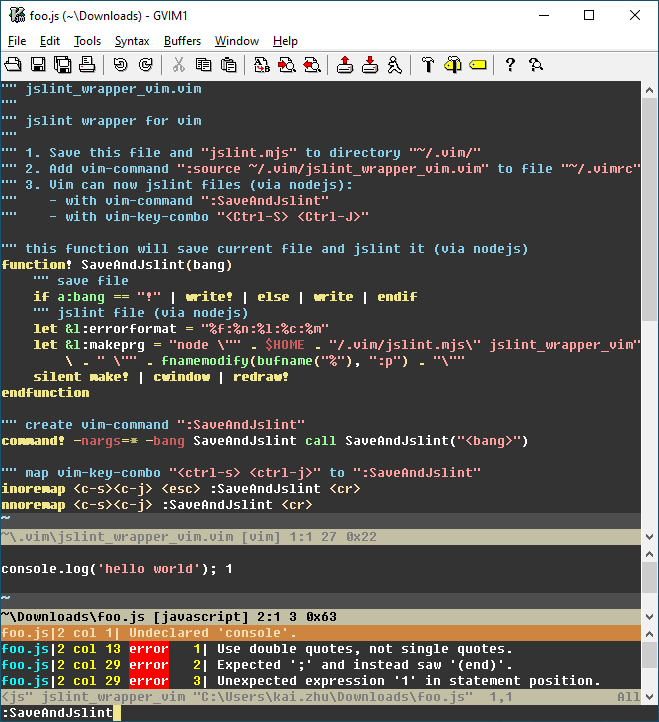

# [](https://github.com/jslint-org/jslint) JSLint, The JavaScript Code Quality and Coverage Tool
Douglas Crockford <douglas@crockford.com>


# Status
| Branch | [master<br>(v2026.4.30)](https://github.com/jslint-org/jslint/tree/master) | [beta<br>(Web Demo)](https://github.com/jslint-org/jslint/tree/beta) | [alpha<br>(Development)](https://github.com/jslint-org/jslint/tree/alpha) |
|--:|:--:|:--:|:--:|
| CI | [](https://github.com/jslint-org/jslint/actions?query=branch%3Amaster) | [](https://github.com/jslint-org/jslint/actions?query=branch%3Abeta) | [](https://github.com/jslint-org/jslint/actions?query=branch%3Aalpha) |
| Coverage | [](https://jslint-org.github.io/jslint/branch-master/.artifact/coverage/index.html) | [](https://jslint-org.github.io/jslint/branch-beta/.artifact/coverage/index.html) | [](https://jslint-org.github.io/jslint/branch-alpha/.artifact/coverage/index.html) |
| Demo | [](https://jslint-org.github.io/jslint/branch-master/index.html) | [](https://jslint-org.github.io/jslint/branch-beta/index.html) | [](https://jslint-org.github.io/jslint/branch-alpha/index.html) |
| Artifacts | [](https://github.com/jslint-org/jslint/tree/gh-pages/branch-master/.artifact) | [](https://github.com/jslint-org/jslint/tree/gh-pages/branch-beta/.artifact) | [](https://github.com/jslint-org/jslint/tree/gh-pages/branch-alpha/.artifact) |


<br><br>
# Table of Contents

1. [Web Demo](#web-demo)

2. [Web Demo Archived](#web-demo-archived)

3. [Quickstart Install](#quickstart-install)
    - [To install, just download and save https://www.jslint.com/jslint.mjs to file:](#to-install-just-download-and-save-httpswwwjslintcomjslintmjs-to-file)
    - [To run `jslint.mjs` in shell:](#to-run-jslintmjs-in-shell)
    - [To import `jslint.mjs` in ES Module environment:](#to-import-jslintmjs-in-es-module-environment)
    - [To import `jslint.mjs` in CommonJS environment:](#to-import-jslintmjs-in-commonjs-environment)
    - [To JSLint entire directory in shell:](#to-jslint-entire-directory-in-shell)

4. [Quickstart JSLint Report](#quickstart-jslint-report)
    - [To create a JSLint report in shell:](#to-create-a-jslint-report-in-shell)
    - [To create a JSLint report in javascript:](#to-create-a-jslint-report-in-javascript)

5. [Quickstart V8 Coverage Report](#quickstart-v8-coverage-report)
    - [To create V8 coverage report from Node.js / Npm program in shell:](#to-create-v8-coverage-report-from-nodejs--npm-program-in-shell)
    - [To create V8 coverage report from Node.js / Npm program in javascript:](#to-create-v8-coverage-report-from-nodejs--npm-program-in-javascript)

6. [Quickstart JSLint in CodeMirror](#quickstart-jslint-in-codemirror)

7. [Quickstart JSLint in Vim](#quickstart-jslint-in-vim)

8. [Quickstart JSLint in VSCode](#quickstart-jslint-in-vscode)

9. [Documentation](#documentation)
    - [API Doc](#api-doc)
    - [Directive](#directive)
        - [`/*jslint beta*/`](#jslint-beta)
        - [`/*jslint bitwise*/`](#jslint-bitwise)
        - [`/*jslint browser*/`](#jslint-browser)
        - [`/*jslint convert*/`](#jslint-convert)
        - [`/*jslint couch*/`](#jslint-couch)
        - [`/*jslint devel*/`](#jslint-devel)
        - [`/*jslint eval*/`](#jslint-eval)
        - [`/*jslint fart*/`](#jslint-fart)
        - [`/*jslint for*/`](#jslint-for)
        - [`/*jslint getset*/`](#jslint-getset)
        - [`/*jslint indent2*/`](#jslint-indent2)
        - [`/*jslint long*/`](#jslint-long)
        - [`/*jslint node*/`](#jslint-node)
        - [`/*jslint nomen*/`](#jslint-nomen)
        - [`/*jslint single*/`](#jslint-single)
        - [`/*jslint subscript*/`](#jslint-subscript)
        - [`/*jslint this*/`](#jslint-this)
        - [`/*jslint trace*/`](#jslint-trace)
        - [`/*jslint unordered*/`](#jslint-unordered)
        - [`/*jslint white*/`](#jslint-white)
        - [`/*global*/`](#global)
        - [`/*property*/`](#property)
        - [`/*jslint-disable*/.../*jslint-enable*/`](#jslint-disablejslint-enable)
        - [`//jslint-ignore-line`](#jslint-ignore-line)
        - [`/*coverage-disable*/.../*coverage-enable*/`](#coverage-disablecoverage-enable)
        - [`//coverage-ignore-line`](#coverage-ignore-line)
    - [ECMAScript Feature Support](#ecmascript-feature-support)

10. [Package Listing](#package-listing)

11. [Changelog](#changelog)

12. [License](#license)

13. [Devops Instruction](#devops-instruction)
    - [pull-request merge](#pull-request-merge)
    - [branch-master commit](#branch-master-commit)
    - [branch-master publish](#branch-master-publish)
    - [vscode-jslint publish](#vscode-jslint-publish)


<br><br>
# Web Demo
- https://www.jslint.com

[](https://jslint-org.github.io/jslint/index.html)


<br><br>
# Web Demo Archived
- [Web Demo 2020](https://www.jslint.com/branch-v2020.11.6/index.html)
- [Web Demo 2014 (ES5 only)](https://www.jslint.com/branch-v2014.7.8/jslint.html)
- [Web Demo 2013 (ES5, CSS, HTML)](https://www.jslint.com/branch-v2013.3.13/jslint.html)


<br><br>
# Quickstart Install


<br><br>
### To install, just download and save https://www.jslint.com/jslint.mjs to file:
```shell <!-- shRunWithScreenshotTxt .artifact/screenshot_sh_install_download.svg -->
#!/bin/sh

curl -L https://www.jslint.com/jslint.mjs > jslint.mjs
```
- shell output


<br><br>
### To run `jslint.mjs` in shell:
```shell <!-- shRunWithScreenshotTxt .artifact/screenshot_sh_jslint_file.svg -->
#!/bin/sh

printf "console.log('hello world');\n" > hello.js

node jslint.mjs hello.js
```
- shell output


<br><br>
### To import `jslint.mjs` in ES Module environment:
```shell <!-- shRunWithScreenshotTxt .artifact/screenshot_js_import_esm.svg -->
#!/bin/sh

node --input-type=module --eval '

/*jslint devel*/

// Import JSLint in ES Module environment.

import jslint from "./jslint.mjs";

let globals = ["caches", "indexedDb"];
let options = {browser: true};
let result;
let source = "console.log(\u0027hello world\u0027);\n";

// JSLint <source> and print <formatted_message>.

result = jslint.jslint(source, options, globals);
result.warnings.forEach(function ({
    formatted_message
}) {
    console.error(formatted_message);
});

'
```
- shell output


<br><br>
### To import `jslint.mjs` in CommonJS environment:
```shell <!-- shRunWithScreenshotTxt .artifact/screenshot_js_import_cjs.svg -->
#!/bin/sh

node --eval '

/*jslint devel*/
(async function () {
    let globals = ["caches", "indexedDb"];
    let jslint;
    let options = {browser: true};
    let result;
    let source = "console.log(\u0027hello world\u0027);\n";

// Import JSLint in CommonJS environment.

    jslint = await import("./jslint.mjs");
    jslint = jslint.default;

// JSLint <source> and print <formatted_message>.

    result = jslint.jslint(source, options, globals);
    result.warnings.forEach(function ({
        formatted_message
    }) {
        console.error(formatted_message);
    });
}());

'
```
- shell output


<br><br>
### To JSLint entire directory in shell:
```shell <!-- shRunWithScreenshotTxt .artifact/screenshot_sh_jslint_dir.svg -->
#!/bin/sh

# JSLint directory '.'

node jslint.mjs .
```
- shell output


<br><br>
# Quickstart JSLint Report


<br><br>
### To create a JSLint report in shell:
```shell <!-- shRunWithScreenshotTxt .artifact/screenshot_sh_jslint_report_file.svg -->
#!/bin/sh

printf "function foo() {console.log('hello world');}\n" > hello.js

# Create JSLint report from file 'hello.js' in shell.

node jslint.mjs \
    jslint_report=.artifact/jslint_report_hello.html \
    hello.js
```
- shell output


- screenshot file [.artifact/jslint_report_hello.html](https://jslint-org.github.io/jslint/branch-beta/.artifact/jslint_report_hello.html)

[](https://jslint-org.github.io/jslint/branch-beta/.artifact/jslint_report_hello.html)


<br><br>
### To create a JSLint report in javascript:
```shell <!-- shRunWithScreenshotTxt .artifact/screenshot_js_jslint_report_file.svg -->
#!/bin/sh

node --input-type=module --eval '

/*jslint devel*/
import jslint from "./jslint.mjs";
import fs from "fs";
(async function () {
    let result;
    let source = "function foo() {console.log(\u0027hello world\u0027);}\n";

// Create JSLint report from <source> in javascript.

    result = jslint.jslint(source);
    result = jslint.jslint_report(result);
    result = `<body class="JSLINT_ JSLINT_REPORT_">\n${result}</body>\n`;

    await fs.promises.mkdir(".artifact/", {recursive: true});
    await fs.promises.writeFile(".artifact/jslint_report_hello.html", result);
    console.error("wrote file .artifact/jslint_report_hello.html");
}());

'
```
- shell output


- screenshot file [.artifact/jslint_report_hello.html](https://jslint-org.github.io/jslint/branch-beta/.artifact/jslint_report_hello.html)

[](https://jslint-org.github.io/jslint/branch-beta/.artifact/jslint_report_hello.html)


<br><br>
# Quickstart V8 Coverage Report


<br><br>
### To create V8 coverage report from Node.js / Npm program in shell:
```shell <!-- shRunWithScreenshotTxt .artifact/screenshot_sh_coverage_report_spawn.svg -->
#!/bin/sh

git clone https://github.com/tryghost/node-sqlite3 node-sqlite3-sh \
    --branch=v5.0.11 \
    --depth=1 \
    --single-branch

cd node-sqlite3-sh
npm install

# Create V8 coverage report from program `npm run test` in shell.

node ../jslint.mjs \
    v8_coverage_report=../.artifact/coverage_sqlite3_sh/ \
        --exclude=tes?/ \
        --exclude=tes[!0-9A-Z_a-z-]/ \
        --exclude=tes[0-9A-Z_a-z-]/ \
        --exclude=tes[^0-9A-Z_a-z-]/ \
        --exclude=test/**/*.js \
        --exclude=test/suppor*/*elper.js \
        --exclude=test/suppor?/?elper.js \
        --exclude=test/support/helper.js \
        --include=**/*.cjs \
        --include=**/*.js \
        --include=**/*.mjs \
        --include=li*/*.js \
        --include=li?/*.js \
        --include=lib/ \
        --include=lib/**/*.js \
        --include=lib/*.js \
        --include=lib/sqlite3.js \
    npm run test
```
- shell output


- screenshot file [.artifact/coverage_sqlite3_sh/index.html](https://jslint-org.github.io/jslint/branch-beta/.artifact/coverage_sqlite3_sh/index.html)

[](https://jslint-org.github.io/jslint/branch-beta/.artifact/coverage_sqlite3_sh/index.html)

- screenshot file [.artifact/coverage_sqlite3_sh/lib/sqlite3.js.html](https://jslint-org.github.io/jslint/branch-beta/.artifact/coverage_sqlite3_sh/lib/sqlite3.js.html)

[](https://jslint-org.github.io/jslint/branch-beta/.artifact/coverage_sqlite3_sh/lib/sqlite3.js.html)


<br><br>
### To create V8 coverage report from Node.js / Npm program in javascript:
```shell <!-- shRunWithScreenshotTxt .artifact/screenshot_js_coverage_report_spawn.svg -->
#!/bin/sh

git clone https://github.com/tryghost/node-sqlite3 node-sqlite3-js \
    --branch=v5.0.11 \
    --depth=1 \
    --single-branch

cd node-sqlite3-js
npm install

node --input-type=module --eval '

/*jslint node*/
import jslint from "../jslint.mjs";
(async function () {

// Create V8 coverage report from program `npm run test` in javascript.

    await jslint.v8CoverageReportCreate({
        coverageDir: "../.artifact/coverage_sqlite3_js/",
        processArgv: [
            "--exclude=tes?/",
            "--exclude=tes[!0-9A-Z_a-z-]/",
            "--exclude=tes[0-9A-Z_a-z-]/",
            "--exclude=tes[^0-9A-Z_a-z-]/",
            "--exclude=test/**/*.js",
            "--exclude=test/suppor*/*elper.js",
            "--exclude=test/suppor?/?elper.js",
            "--exclude=test/support/helper.js",
            "--include=**/*.cjs",
            "--include=**/*.js",
            "--include=**/*.mjs",
            "--include=li*/*.js",
            "--include=li?/*.js",
            "--include=lib/",
            "--include=lib/**/*.js",
            "--include=lib/*.js",
            "--include=lib/sqlite3.js",
            "npm", "run", "test"
        ]
    });
}());

'
```
- shell output


- screenshot file [.artifact/coverage_sqlite3_js/index.html](https://jslint-org.github.io/jslint/branch-beta/.artifact/coverage_sqlite3_js/index.html)

[](https://jslint-org.github.io/jslint/branch-beta/.artifact/coverage_sqlite3_js/index.html)

- screenshot file [.artifact/coverage_sqlite3_js/lib/sqlite3.js.html](https://jslint-org.github.io/jslint/branch-beta/.artifact/coverage_sqlite3_js/lib/sqlite3.js.html)

[](https://jslint-org.github.io/jslint/branch-beta/.artifact/coverage_sqlite3_js/lib/sqlite3.js.html)


<br><br>
# Quickstart JSLint in CodeMirror
1. Download and save [`jslint.mjs`](https://www.jslint.com/jslint.mjs), [`jslint_wrapper_codemirror.js`](https://www.jslint.com/jslint_wrapper_codemirror.js) to file.

2. Edit, save, and serve example html-file below:
```html <!-- jslint_wrapper_codemirror.html -->
<!DOCTYPE html>
<html lang="en">
<head>
    <meta charset="utf-8">
    <title>CodeMirror: JSLint Demo</title>

<!-- Assets from codemirror. -->

    <link rel="stylesheet" href="https://cdnjs.cloudflare.com/ajax/libs/codemirror/5.65.10/codemirror.css">
    <link rel="stylesheet" href="https://cdnjs.cloudflare.com/ajax/libs/codemirror/5.65.10/addon/lint/lint.css">
    <script defer src="https://cdnjs.cloudflare.com/ajax/libs/codemirror/5.65.10/codemirror.js"></script>
    <script defer src="https://cdnjs.cloudflare.com/ajax/libs/codemirror/5.65.10/mode/javascript/javascript.js"></script>
    <script defer src="https://cdnjs.cloudflare.com/ajax/libs/codemirror/5.65.10/addon/lint/lint.js"></script>

<!-- Assets from jslint. -->

    <script type="module" src="./jslint.mjs?window_jslint=1"></script>
    <script defer src="./jslint_wrapper_codemirror.js"></script>
<style>
body {
    background: #bbb;
    color: #333;
    font-family: sans-serif;
    margin: 20px;
}
.JSLINT_.JSLINT_REPORT_ {
    margin-top: 20px;
}
#editor1 {
    height: 300px;
    width: 100%;
}
</style>
</head>


<body>
    <h1>CodeMirror: JSLint Demo</h1>
    <h3>
This demo will auto-lint the code below, and auto-generate a report as you type.
    </h3>

<!-- Container for codemirror-editor. -->

    <textarea id="editor1">console.log('hello world');</textarea>

<!-- Container for jslint-report. -->

    <div class="JSLINT_ JSLINT_REPORT_"></div>


<script type=module>
window.addEventListener("load", function () {
    let editor = window.CodeMirror.fromTextArea(document.getElementById(
        "editor1"
    ), {
        gutters: [
            "CodeMirror-lint-markers"
        ],
        indentUnit: 4,
        lineNumbers: true,
        lint: {
            lintOnChange: true, // Enable auto-lint.
            options: {
                // browser: true,
                // node: true
                globals: [
                    // "caches",
                    // "indexedDb"
                ]
            }
        },
        mode: "javascript"
    });

// Initialize event-handling before linter is run.

    editor.on("lintJslintBefore", function (/* options */) {
        // options.browser = true;
        // options.node = true;
        // options.globals = [
        //     "caches",
        //     "indexedDb"
        // ];
        return;
    });

// Initialize event-handling after linter is run.

    editor.on("lintJslintAfter", function (options) {

// Generate jslint-report from options.result.

        document.querySelector(
            ".JSLINT_REPORT_"
        ).innerHTML = window.jslint.jslint_report(options.result);
    });

// Manually trigger linter.

    editor.performLint();
});
</script>
</body>
</html>
```
3. Live example at https://www.jslint.com/jslint_wrapper_codemirror.html

[](https://jslint-org.github.io/jslint/jslint_wrapper_codemirror.html)


<br><br>
# Quickstart JSLint in Vim
1. Download and save [`jslint.mjs`](https://www.jslint.com/jslint.mjs), [`jslint_wrapper_vim.vim`](https://www.jslint.com/jslint_wrapper_vim.vim) to directory `~/.vim/`
2. Add vim-command `:source ~/.vim/jslint_wrapper_vim.vim` to file `~/.vimrc`
    - If above files were saved to custom-directory, then use that directory instead, e.g.:
        - save [`jslint.mjs`](https://www.jslint.com/jslint.mjs), [`jslint_wrapper_vim.vim`](https://www.jslint.com/jslint_wrapper_vim.vim) to directory `~/vimfiles/`
        - vim-command `:source ~/vimfiles/jslint_wrapper_vim.vim`
3. Vim can now jslint files (via nodejs):
    - with vim-command `:SaveAndJslint`
    - with vim-key-combo `<Ctrl-S> <Ctrl-J>`
- screenshot

[](https://www.jslint.com/jslint_wrapper_vim.vim)


<br><br>
# Quickstart JSLint in VSCode
1. In VSCode, search and install extension [`vscode-jslint`](https://marketplace.visualstudio.com/items?itemName=jslint.vscode-jslint)
2. In VSCode, while editing a javascript file:
    - right-click context-menu and select `[JSLint - Lint File]`
    - or use key-binding `[Ctrl + Shift + J], [L]`
    - or use key-binding `[ Cmd + Shift + J], [L]` for Mac
- screenshot

[](https://marketplace.visualstudio.com/items?itemName=jslint.vscode-jslint)


<br><br>
# Documentation
- [jslint.mjs](jslint.mjs) contains the jslint function. It parses and analyzes a source file, returning an object with information about the file. It can also take an object that sets options.
- [index.html](index.html) runs the jslint.mjs function in a web page.


<br><br>
### API Doc
- https://www.jslint.com/apidoc.html

[](https://www.jslint.com/apidoc.html)


<br><br>
### Directive

<br>

##### `/*jslint beta*/`
```js
/*jslint beta*/
// Enable experimental warnings.
// Warn if global variables are redefined.
// Warn if const / let statements are not declared at top of function or
//    script, similar to var statements.
// Warn if const / let / var statements are not declared in ascii-order.
// Warn if named-functions are not declared in ascii-order.
// Warn if cases in switch-statements are not in ascii-order.
```

<br>

##### `/*jslint bitwise*/`
```js
/*jslint bitwise*/
// Allow bitwise operator.

let foo = 0 | 1;
```

<br>

##### `/*jslint browser*/`
```js
/*jslint browser*/
// Assume browser environment.

localStorage.getItem("foo");
```

<br>

##### `/*jslint convert*/`
```js
/*jslint convert*/
// Allow conversion operator.

let foo = new Date() + "";
let bar = !!0;
```

<br>

##### `/*jslint couch*/`
```js
/*jslint couch*/
// Assume CouchDb environment.

registerType("text-json", "text/json");
```

<br>

##### `/*jslint devel*/`
```js
/*jslint devel*/
// Allow console.log() and friends.

console.log("hello");
```

<br>

##### `/*jslint eval*/`
```js
/*jslint eval*/
// Allow eval().

eval("1");
```

<br>

##### `/*jslint fart*/`
```js
/*jslint fart*/
// Allow complex fat-arrow.

let foo = async ({bar, baz}) => {
    return await bar(baz);
};
```

<br>

##### `/*jslint for*/`
```js
/*jslint for*/
// Allow for-loop.

function foo() {
    let ii;
    for (ii = 0; ii < 10; ii += 1) {
        foo();
    }
}
```

<br>

##### `/*jslint getset*/`
```js
/*jslint getset, this, devel*/
// Allow get() and set().

let foo = {
    bar: 0,
    get getBar() {
        return this.bar;
    },
    set setBar(value) {
        this.bar = value;
    }
};
console.log(foo.getBar); // 0
foo.setBar = 1;
console.log(foo.getBar); // 1
```

<br>

##### `/*jslint indent2*/`
```js
/*jslint indent2*/
// Use 2-space indent.

function foo() {
  return;
}
```

<br>

##### `/*jslint long*/`
```js
/*jslint long*/
// Allow long lines.

let foo = "aaaaaaaaaaaaaaaaaaaaaaaaaaaaaaaaaaaaaaaaaaaaaaaaaaaaaaaaaaaaaaaaaaaa";
```

<br>

##### `/*jslint node*/`
```js
/*jslint node*/
// Assume Node.js environment.

require("fs");
```

<br>

##### `/*jslint nomen*/`
```js
/*jslint nomen*/
// Allow weird property name.

let foo = {};
foo._bar = 1;
```

<br>

##### `/*jslint single*/`
```js
/*jslint single*/
// Allow single-quote strings.

let foo = '';
```

<br>

##### `/*jslint subscript*/`
```js
/*jslint subscript*/
// Allow identifiers in subscript-notation.

let foo = {};
foo["bar"] = 1;
```

<br>

##### `/*jslint this*/`
```js
/*jslint this*/
// Allow 'this'.

function foo() {
    return this;
}
```

<br>

##### `/*jslint trace*/`
```js
/*jslint trace*/
// Include jslint stack-trace in warnings.

console.log('hello world');
/*
1. Undeclared 'console'.
console.log('hello world');
Error
    at warn_at (...)
    at warn (...)
    at lookup (...)
    at pre_v (...)
    at jslint.mjs
2. Use double quotes, not single quotes.
console.log(...);
Error
    at warn_at (...)
    at lex_string (...)
    at lex_token (...)
    at jslint_phase2_lex (...)
    at Function.jslint (...)
    at jslint.mjs
*/
```

<br>

##### `/*jslint unordered*/`
```js
/*jslint unordered*/
// Allow unordered cases, params, properties, variables, and exports.

let foo = {bb: 1, aa: 0};

function bar({
    bb = 1,
    aa = 0
}) {
    return aa + bb;
}

export {
    foo,
    bar
};
```

<br>

##### `/*jslint white*/`
```js
/*jslint white*/
// Allow messy whitespace.

let foo = 1; let bar = 2;
```

<br>

##### `/*global*/`
```js
/*global foo, bar*/
// Declare global variables foo, bar.

foo();
bar();
```

<br>

##### `/*property*/`
```js
/*property foo, bar*/
// Restrict property-access to only .foo, .bar.

let aa = {bar: 1, foo: 2};
```

<br>

##### `/*jslint-disable*/.../*jslint-enable*/`
```js
/*jslint-disable*/

JSLint will ignore and treat this region as blank-lines.
Syntax error.

/*jslint-enable*/
```

<br>

##### `//jslint-ignore-line`
```js
// JSLint will ignore non-fatal warnings at given line.

eval("1"); //jslint-ignore-line
```

<br>

##### `/*coverage-disable*/.../*coverage-enable*/`
```js
/*coverage-disable*/

// JSLint will ignore code-coverage in this region.

if (false) {
    console.log("hello world");
}

/*coverage-enable*/
```

<br>

##### `//coverage-ignore-line`
```js
// JSLint will ignore code-coverage at given line.

if (false) {
    console.log("hello world"); //coverage-ignore-line
}
```


<br><br>
### ECMAScript Feature Support
- https://github.com/tc39/proposals/blob/main/finished-proposals.md
- https://github.com/lukehoban/es6features

| #. | JSLint Support | ES Version | ES Feature |
|--:|:--|:--|:--|
|  99. | &#x274c; | ES2027 | [`Explicit Resource Management`](https://github.com/tc39/proposal-explicit-resource-management) |
|  98. | &#x2705; | ES2027 | [`Atomics.pause`](https://github.com/tc39/proposal-atomics-microwait) |
|  97. | &#x274c; | ES2027 | [`Joint Iteration`](https://github.com/tc39/proposal-joint-iteration) |
|  96. | &#x2705; | ES2027 | [`Temporal`](https://github.com/tc39/proposal-temporal) |
|  95. | &#x2705; | ES2026 | [`Upsert`](https://github.com/tc39/proposal-upsert) |
|  94. | &#x2705; | ES2026 | [`JSON.parse source text access`](https://github.com/tc39/proposal-json-parse-with-source) |
|  93. | &#x274c; | ES2026 | [`Iterator Sequencing`](https://github.com/tc39/proposal-iterator-sequencing) |
|  92. | &#x2705; | ES2026 | [`Uint8Array to/from Base64`](https://github.com/tc39/proposal-arraybuffer-base64) |
|  91. | &#x2705; | ES2026 | [`Math.sumPrecise`](https://github.com/tc39/proposal-math-sum) |
|  90. | &#x2705; | ES2026 | [`Error.isError`](https://github.com/tc39/proposal-is-error) |
|  89. | &#x2705; | ES2026 | [`Array.fromAsync`](https://github.com/tc39/proposal-array-from-async) |
|  88. | &#x2705; | ES2025 | [`RegExp.escape`](https://github.com/tc39/proposal-regex-escaping) |
|  87. | &#x2705; | ES2025 | [`Redeclarable global eval-introduced vars`](https://github.com/tc39/proposal-redeclarable-global-eval-vars) |
|  86. | &#x2705; | ES2025 | [`Float16 on TypedArrays, DataView, Math.f16round`](https://github.com/tc39/proposal-float16array) |
|  85. | &#x2705; | ES2025 | [`Promise.try`](https://github.com/tc39/proposal-promise-try) |
|  84. | &#x274c; | ES2025 | [`Sync Iterator helpers`](https://github.com/tc39/proposal-iterator-helpers) |
|  83. | &#x2705; | ES2025 | [`JSON Modules`](https://github.com/tc39/proposal-json-modules) |
|  82. | &#x2705; | ES2025 | [`Import Attributes`](https://github.com/tc39/proposal-import-attributes) |
|  81. | &#x2705; | ES2025 | [`RegExp Modifiers`](https://github.com/tc39/proposal-regexp-modifiers) |
|  80. | &#x2705; | ES2025 | [`New Set methods`](https://github.com/tc39/proposal-set-methods) |
|  79. | &#x2705; | ES2025 | [`Duplicate named capture groups`](https://github.com/tc39/proposal-duplicate-named-capturing-groups) |
|  78. | &#x2705; | ES2024 | [`ArrayBuffer transfer`](https://github.com/tc39/proposal-arraybuffer-transfer) |
|  77. | &#x2705; | ES2024 | [`Promise.withResolvers`](https://github.com/tc39/proposal-promise-with-resolvers) |
|  76. | &#x2705; | ES2024 | [`Array Grouping`](https://github.com/tc39/proposal-array-grouping) |
|  75. | &#x2705; | ES2024 | [`Resizable and growable ArrayBuffers`](https://github.com/tc39/proposal-resizablearraybuffer) |
|  74. | &#x26a0; | ES2024 | [`RegExp v flag with set notation + properties of strings`](https://github.com/tc39/proposal-regexp-v-flag) |
|  73. | &#x2705; | ES2024 | [`Atomics.waitAsync`](https://github.com/tc39/proposal-atomics-wait-async) |
|  72. | &#x2705; | ES2024 | [`Well-Formed Unicode Strings`](https://github.com/tc39/proposal-is-usv-string) |
|  71. | &#x2705; | ES2023 | [`Change Array by Copy`](https://github.com/tc39/proposal-change-array-by-copy) |
|  70. | &#x2705; | ES2023 | [`Symbols as WeakMap keys`](https://github.com/tc39/proposal-symbols-as-weakmap-keys) |
|  69. | &#x2705; | ES2023 | [`Hashbang Grammar`](https://github.com/tc39/proposal-hashbang) |
|  68. | &#x2705; | ES2023 | [`Array find from last`](https://github.com/tc39/proposal-array-find-from-last) |
|  67. | &#x2705; | ES2022 | [`Error Cause`](https://github.com/tc39/proposal-error-cause) |
|  66. | &#x274c; | ES2022 | [`Class Static Block`](https://github.com/tc39/proposal-class-static-block) |
|  65. | &#x2705; | ES2022 | [`Accessible Object.prototype.hasOwnProperty`](https://github.com/tc39/proposal-accessible-object-hasownproperty) |
|  64. | &#x2705; | ES2022 | [`.at()`](https://github.com/tc39/proposal-relative-indexing-method) |
|  63. | &#x274c; | ES2022 | [`Ergonomic brand checks for Private Fields`](https://github.com/tc39/proposal-private-fields-in-in) |
|  62. | &#x2705; | ES2022 | [`Top-level await`](https://github.com/tc39/proposal-top-level-await) |
|  61. | &#x2705; | ES2022 | [`RegExp Match Indices`](https://github.com/tc39/proposal-regexp-match-indices) |
|  60. | &#x274c; | ES2022 | [`Class Public Instance Fields & Private Instance Fields`](https://github.com/tc39/proposal-class-fields) |
|  59. | &#x2705; | ES2021 | [`Numeric separators`](https://github.com/tc39/proposal-numeric-separator) |
|  58. | &#x2705; | ES2021 | [`Logical Assignment Operators`](https://github.com/tc39/proposal-logical-assignment) |
|  57. | &#x2705; | ES2021 | [`WeakRefs`](https://github.com/tc39/proposal-weakrefs) |
|  56. | &#x2705; | ES2021 | [`Promise.any`](https://github.com/tc39/proposal-promise-any) |
|  55. | &#x2705; | ES2021 | [`String.prototype.replaceAll`](https://github.com/tc39/proposal-string-replaceall) |
|  54. | &#x2705; | ES2020 | [`import.meta`](https://github.com/tc39/proposal-import-meta) |
|  53. | &#x2705; | ES2020 | [`Nullish coalescing Operator`](https://github.com/tc39/proposal-nullish-coalescing) |
|  52. | &#x2705; | ES2020 | [`Optional Chaining`](https://github.com/tc39/proposal-optional-chaining) |
|  51. | &#x2705; | ES2020 | [`for-in mechanics`](https://github.com/tc39/proposal-for-in-order) |
|  50. | &#x2705; | ES2020 | [`globalThis`](https://github.com/tc39/proposal-global) |
|  49. | &#x2705; | ES2020 | [`Promise.allSettled`](https://github.com/tc39/proposal-promise-allSettled) |
|  48. | &#x2705; | ES2020 | [`BigInt`](https://github.com/tc39/proposal-bigint) |
|  47. | &#x2705; | ES2020 | [`import()`](https://github.com/tc39/proposal-dynamic-import) |
|  46. | &#x2705; | ES2020 | [`String.prototype.matchAll`](https://github.com/tc39/proposal-string-matchall) |
|  45. | &#x2705; | ES2019 | [`Array.prototype.{flat,flatMap}`](https://github.com/tc39/proposal-flatMap) |
|  44. | &#x2705; | ES2019 | [`String.prototype.{trimStart,trimEnd}`](https://github.com/tc39/proposal-string-left-right-trim) |
|  43. | &#x2705; | ES2019 | [`Well-formed JSON.stringify`](https://github.com/tc39/proposal-well-formed-stringify) |
|  42. | &#x2705; | ES2019 | [`Object.fromEntries`](https://github.com/tc39/proposal-object-from-entries) |
|  41. | &#x2705; | ES2019 | [`Function.prototype.toString revision`](https://github.com/tc39/Function-prototype-toString-revision) |
|  40. | &#x2705; | ES2019 | [`Symbol.prototype.description`](https://github.com/tc39/proposal-Symbol-description) |
|  39. | &#x2705; | ES2019 | [`JSON superset`](https://github.com/tc39/proposal-json-superset) |
|  38. | &#x2705; | ES2019 | [`Optional catch binding`](https://github.com/tc39/proposal-optional-catch-binding) |
|  37. | &#x274c; | ES2018 | [`Asynchronous Iteration`](https://github.com/tc39/proposal-async-iteration) |
|  36. | &#x2705; | ES2018 | [`Promise.prototype.finally`](https://github.com/tc39/proposal-promise-finally) |
|  35. | &#x2705; | ES2018 | [`RegExp Unicode Property Escapes`](https://github.com/tc39/proposal-regexp-unicode-property-escapes) |
|  34. | &#x2705; | ES2018 | [`RegExp Lookbehind Assertions`](https://github.com/tc39/proposal-regexp-lookbehind) |
|  33. | &#x2705; | ES2018 | [`Rest/Spread Properties`](https://github.com/tc39/proposal-object-rest-spread) |
|  32. | &#x2705; | ES2018 | [`RegExp named capture groups`](https://github.com/tc39/proposal-regexp-named-groups) |
|  31. | &#x2705; | ES2018 | [`s (dotAll) flag for regular expressions`](https://github.com/tc39/proposal-regexp-dotall-flag) |
|  30. | &#x2705; | ES2018 | [`Lifting template literal restriction`](https://github.com/tc39/proposal-template-literal-revision) |
|  29. | &#x2705; | ES2017 | [`Shared memory and atomics`](https://github.com/tc39/proposal-ecmascript-sharedmem) |
|  28. | &#x2705; | ES2017 | [`Async functions`](https://github.com/tc39/proposal-async-await) |
|  27. | &#x26a0; | ES2017 | [`Trailing commas in function parameter lists and calls`](https://github.com/tc39/proposal-trailing-function-commas) |
|  26. | &#x2705; | ES2017 | [`Object.getOwnPropertyDescriptors`](https://github.com/tc39/proposal-object-getownpropertydescriptors) |
|  25. | &#x2705; | ES2017 | [`String padding`](https://github.com/tc39/proposal-string-pad-start-end) |
|  24. | &#x2705; | ES2017 | [`Object.values/Object.entries`](https://github.com/tc39/proposal-object-values-entries) |
|  23. | &#x2705; | ES2016 | [`Exponentiation operator`](https://github.com/tc39/proposal-exponentiation-operator) |
|  22. | &#x2705; | ES2016 | [`Array.prototype.includes`](https://github.com/tc39/proposal-Array.prototype.includes) |
|  21. | &#x2705; | ES2015 | [`arrows`](https://github.com/lukehoban/es6features#arrows) |
|  20. | &#x274c; | ES2015 | [`classes`](https://github.com/lukehoban/es6features#classes) |
|  19. | &#x274c; | ES2015 | [`enhanced object literals`](https://github.com/lukehoban/es6features#enhanced-object-literals) |
|  18. | &#x2705; | ES2015 | [`template strings`](https://github.com/lukehoban/es6features#template-strings) |
|  17. | &#x2705; | ES2015 | [`destructuring`](https://github.com/lukehoban/es6features#destructuring) |
|  16. | &#x2705; | ES2015 | [`default + rest + spread`](https://github.com/lukehoban/es6features#default--rest--spread) |
|  15. | &#x2705; | ES2015 | [`let + const`](https://github.com/lukehoban/es6features#let--const) |
|  14. | &#x274c; | ES2015 | [`iterators + for..of`](https://github.com/lukehoban/es6features#iterators--forof) |
|  13. | &#x274c; | ES2015 | [`generators`](https://github.com/lukehoban/es6features#generators) |
|  12. | &#x2705; | ES2015 | [`unicode`](https://github.com/lukehoban/es6features#unicode) |
|  11. | &#x26a0; | ES2015 | [`modules`](https://github.com/lukehoban/es6features#modules) |
|  10. | &#x2705; | ES2015 | [`module loaders`](https://github.com/lukehoban/es6features#module-loaders) |
|   9. | &#x2705; | ES2015 | [`map + set + weakmap + weakset`](https://github.com/lukehoban/es6features#map--set--weakmap--weakset) |
|   8. | &#x2705; | ES2015 | [`proxies`](https://github.com/lukehoban/es6features#proxies) |
|   7. | &#x2705; | ES2015 | [`symbols`](https://github.com/lukehoban/es6features#symbols) |
|   6. | &#x274c; | ES2015 | [`subclassable built-ins`](https://github.com/lukehoban/es6features#subclassable-built-ins) |
|   5. | &#x2705; | ES2015 | [`promises`](https://github.com/lukehoban/es6features#promises) |
|   4. | &#x2705; | ES2015 | [`math + number + string + array + object APIs`](https://github.com/lukehoban/es6features#math--number--string--array--object-apis) |
|   3. | &#x2705; | ES2015 | [`binary and octal literals`](https://github.com/lukehoban/es6features#binary-and-octal-literals) |
|   2. | &#x2705; | ES2015 | [`reflect api`](https://github.com/lukehoban/es6features#reflect-api) |
|   1. | &#x2705; | ES2015 | [`tail calls`](https://github.com/lukehoban/es6features#tail-calls) |


<br><br>
# Package Listing


<br><br>
# Changelog
- [Full CHANGELOG.md](CHANGELOG.md)


<br><br>
# License
- JSLint is under [Unlicense License](LICENSE).
- CodeMirror editor is under [MIT License](https://github.com/codemirror/codemirror5/blob/d0e3b2e727c41aa4fd89fbad0adfb3815339174c/LICENSE).
- Function `v8CoverageListMerge` is derived from [MIT Licensed v8-coverage](https://github.com/demurgos/v8-coverage/blob/73446087dc38f61b09832c9867122a23f8577099/ts/LICENSE.md).


<br><br>
# Devops Instruction


<br><br>
### pull-request merge
- find highest issue-number at https://github.com/jslint-org/jslint/issues/, https://github.com/jslint-org/jslint/pulls/, and add +1 to it for PR-xxx
- checkpoint local-branch-beta
- `shGitPullrequest beta beta`
    - verify ci-success for origin-branch-alpha
    - https://github.com/kaizhu256/jslint/actions
- `git push upstream alpha -f`
    - verify ci-success for upstream-branch-alpha
    - https://github.com/jslint-org/jslint/actions
- goto https://github.com/jslint-org/jslint/compare/beta...kaizhu256:jslint:branch-p2026.6.24
- click `Create pull request`
- input `Add your description here...` with:
```
Fixes #xxx.
- <primary-commit-message>

This PR will ...

This PR will additionally:
- <secondary-commit-message>
...

<screenshot>
```
- verify `commit into jslint-org:beta`
- click `Create pull request`
    - verify ci-success for pull-request
    - https://github.com/jslint-org/jslint/actions/workflows/on_pull_request.yml
- wait awhile before continuing ...
- click `Squash and merge`
    - verify ci-success for upstream-branch-beta
    - https://github.com/jslint-org/jslint/actions
- `shGitPullrequestCleanup`
    - verify ci-success for origin-branch-alpha
    - https://github.com/kaizhu256/jslint/actions
- `git push upstream alpha -f`
    - verify ci-success for upstream-branch-alpha
    - https://github.com/jslint-org/jslint/actions
- click `Delete branch`


<br><br>
### branch-master commit
- update ci.yml to latest nodejs-lts
- checkpoint local-branch-beta
- `shGitPullrequest master beta # re-run until version propagates`
    - verify ci-success for origin-branch-alpha
    - https://github.com/kaizhu256/jslint/actions
- `git push upstream alpha -f`
    - verify ci-success for upstream-branch-alpha
    - https://github.com/jslint-org/jslint/actions
- goto https://github.com/jslint-org/jslint/compare/beta...kaizhu256:jslint:branch-v2026.4.30
- click `Create pull request`
- input `Add a title` with: `# v20yy.mm.dd`
- input `Add a description` with:
```
- <primary-commit-message>
- <secondary-commit-message>
```
- verify `commit into jslint-org:beta`
- click `Create pull request`
    - verify ci-success for pull-request
    - https://github.com/jslint-org/jslint/actions/workflows/on_pull_request.yml
- wait awhile before continuing ...
- click `Squash and merge`
    - verify ci-success for upstream-branch-beta
    - https://github.com/jslint-org/jslint/actions
- `shGitPullrequestCleanup`
    - verify ci-success for origin-branch-alpha
    - https://github.com/kaizhu256/jslint/actions
- `git push upstream alpha -f`
    - verify ci-success for upstream-branch-alpha
    - https://github.com/jslint-org/jslint/actions
- click `Delete branch`
- `git push origin beta:master`
    - verify ci-success for origin-branch-master
    - https://github.com/kaizhu256/jslint/actions
- `git push upstream beta:master`
    - verify ci-success for upstream-branch-master
    - https://github.com/jslint-org/jslint/actions


<br><br>
### branch-master publish
- goto https://www.npmjs.com/package/@jslint-org/jslint/access <!--no-validate-->
- click `Github Actions`
- input `Organization or user*` with: `jslint-org`
- input `Repository*` with: `jslint`
- input `Workflow filename*` with: `publish.yml`
- click `Set up connection` or `Update Package Settings`
- `git push upstream beta:master`
    - verify ci-success for upstream-branch-master
    - https://github.com/jslint-org/jslint/actions
- goto https://github.com/jslint-org/jslint/releases/new
- input `Choose a tag` with: `v20yy.mm.dd`
- click `Create new tag: v20yy.mm.dd on publish`
    - verify correct-year `20yy`
- select `Target: master`
- select `Previous tag:auto`
- input `Release title` with: `v20yy.mm.dd - <primary-commit-message>`
- input `Describe this release` with:
```
- <primary-commit-message>
- <secondary-commit-message>
```
- click `Generate release notes`
- click `Set as the latest release`
- click `Preview` and review
- click `Publish release`
    - verify ci-success for upstream-branch-publish
    - https://github.com/jslint-org/jslint/actions
    - verify email-notification `Successfully published @jslint-org/jslint@20yy.mm.dd`


<br><br>
### vscode-jslint publish
- goto https://github.com/jslint-org/jslint/tree/gh-pages/branch-beta/.artifact/jslint_wrapper_vscode
- click `vscode-jslint-20yy.mm.dd.vsix`
- click `Raw` to download
- goto https://marketplace.visualstudio.com/manage/publishers/jslint
- right-click `Update`
- upload downloaded file `vscode-jslint-20yy.mm.dd.vsix`
- click 'Upload'
- verify email-notification `[Succeeded] Extension publish on Visual Studio Marketplace - vscode-jslint`


<!--
Coverage-hack
node --eval '
0
'
-->
